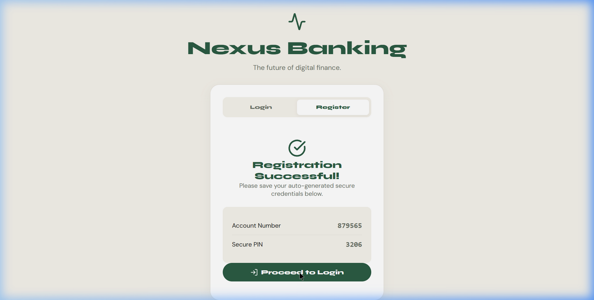
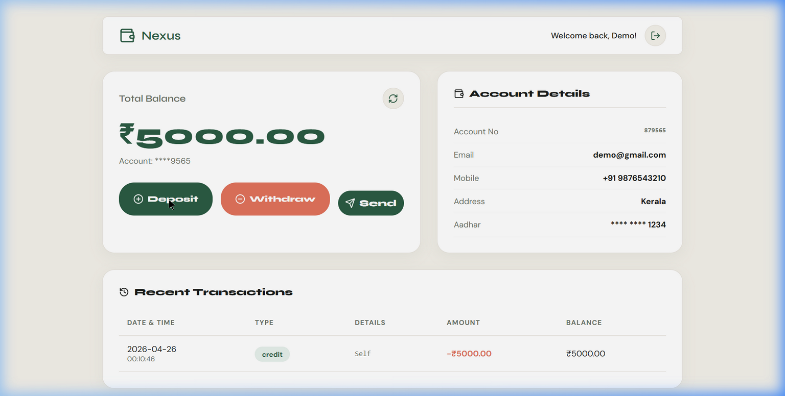
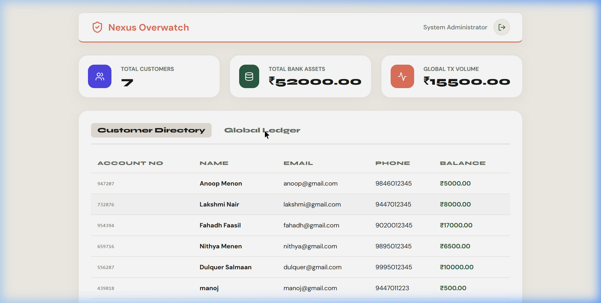

<div align="center">
  
  
  # Nexus Bank Management System
  
  **A full-stack, secure, digital banking platform built for the modern web.**
  
  [](https://reactjs.org/)
  [](https://spring.io/projects/spring-boot)
  [](https://www.mysql.com/)
  [](https://vercel.com/)
  [](https://render.com/)

  <h3>
    🔴 <a href="https://nexus.benherbasheer.me">Live Demo</a> 🔴
  </h3>
</div>

---

## 📖 Overview

Nexus Bank is a comprehensive digital banking solution. Built with a robust **Java Spring Boot backend** and a beautiful **React frontend**, it provides a complete banking lifecycle. Users can experience self-service registration, real-time ledger tracking, instant transfers, and an administrative oversight portal.

## ✨ Features

- **🔐 Auto-Generated Credentials:** Secure 4-digit PINs and unique Account Numbers are auto-generated and safely assigned upon registration.
- **💸 Full Transaction Lifecycle:** Instantly process and record deposits, withdrawals, and inter-account peer-to-peer transfers.
- **📊 Smart Global Ledger:** The system automatically tracks counterparty logic (`To: Account` vs `From: Account`) across a system-wide unified ledger.
- **🛡️ Secure Admin Portal:** Database-backed authentication for bank administrators to view all global transactions and the entire customer directory.
- **✨ Premium UI/UX:** A bespoke "Nordic Earth" design language utilizing sleek glassmorphism, fluid micro-animations, and a responsive component architecture.

---

## 📸 Screenshots

### Modern Registration & Success Flow


### Customer Dashboard

*Real-time balance, user details, and smart transaction history.*

### Admin Oversight Portal

*Secure administrative access to global customer and ledger data.*

---

## 🚀 Getting Started Locally (Docker)

The easiest way to run the entire system on your own machine is using Docker Compose.

### Prerequisites
- [Docker Desktop](https://www.docker.com/products/docker-desktop/) installed and running.

### Quick Start
1. Clone this repository.
2. Run the following command in the project root:
   ```bash
   docker-compose up --build -d
   ```
3. Access the applications:
   - **Frontend:** [http://localhost](http://localhost)
   - **Backend API:** [http://localhost:8080/swagger-ui.html](http://localhost:8080/swagger-ui.html)

---

## ☁️ Cloud Deployment Architecture

This project is fully "Cloud-Ready" and is actively deployed using modern PaaS providers.

### 1. Database (Aiven MySQL)
- MySQL database hosted on [Aiven.io](https://aiven.io/).
- Provides a secure, scalable data layer with enforced SSL.

### 2. Backend (Render.com)
- Spring Boot REST API deployed as a Web Service on [Render](https://render.com).
- Uses Environment Variables for database injection:
  - `SPRING_DATASOURCE_URL` (JDBC URL with SSL enabled)
  - `SPRING_DATASOURCE_USERNAME`
  - `SPRING_DATASOURCE_PASSWORD`

### 3. Frontend (Vercel)
- React SPA deployed globally via [Vercel](https://vercel.com).
- Routes all API calls to the Render backend using the Environment Variable:
  - `VITE_API_BASE_URL`
- Utilizes `vercel.json` to handle client-side routing fallbacks gracefully.

---


